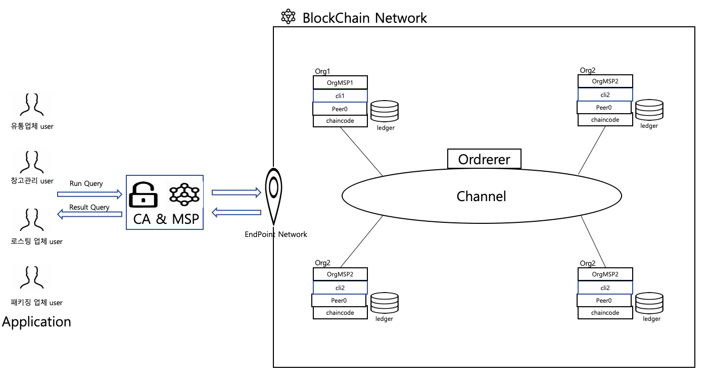
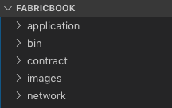
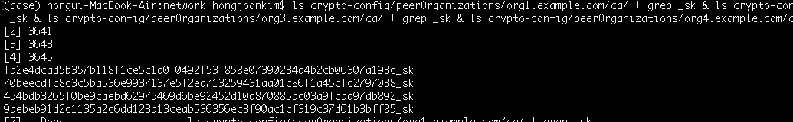
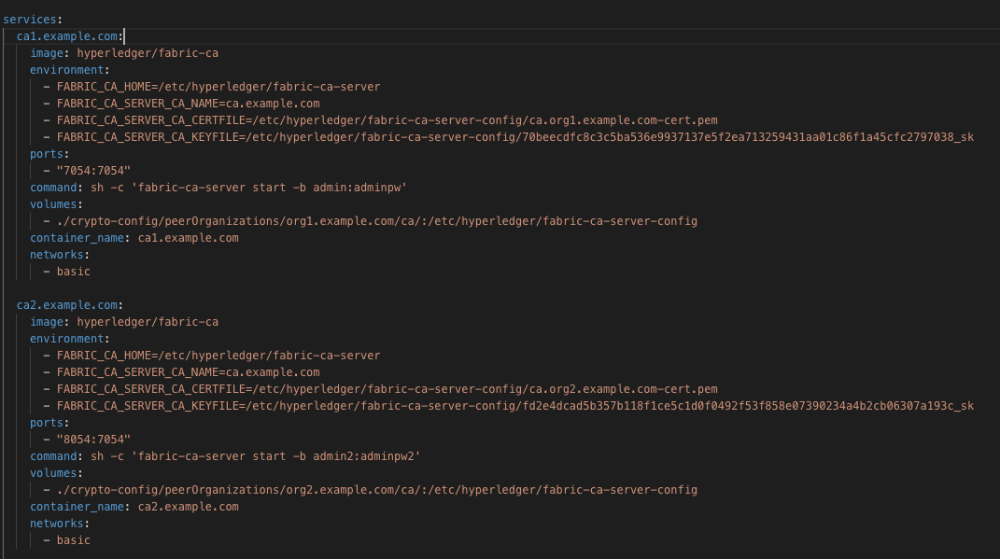
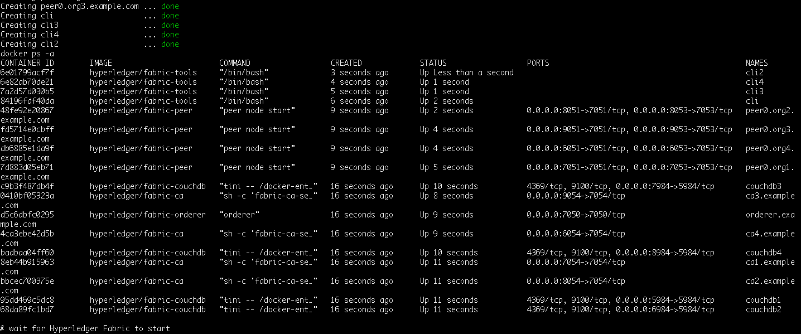
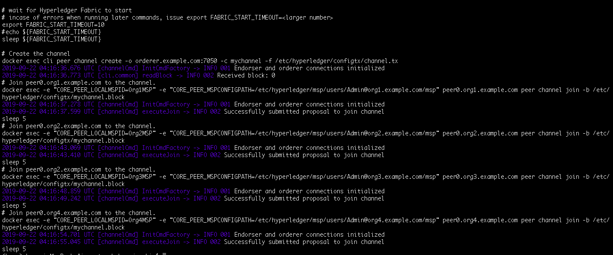
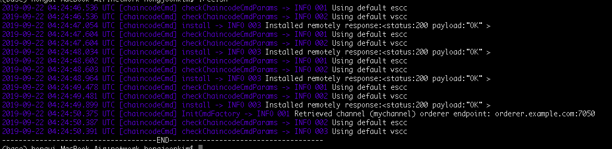

# Hyperledger_coffeeCirculationSystem
하이퍼레져를 활용한 coffee 유통 관리 시스템

# Introduction
원두의 유통과정에는 이해당사자가 유통업체, 배송업체 그리고 카페로 구성이 되었다. 이러한 이해당사자들 사이에서 유통 과정에서 발생하는 불필요한 비용이 발생을 한다. 
이러한 문제점을 Hyperledger Fabricd을 활용하여 해결을 하는 프로젝트이다. 더 나아가 투명하게 관리된 원두의 이력을 바탕으로 정기 배송을 지원하는 부가 서비스를 
추가를 할 것이다. 서버쪽 개발은 NodeJS를 활용을 하였고, 네트워크는 docker-compose를 활용하여 단일 노드에서 구성을 하였고, 마지막으로 체인코드는 GoLang으로 작성을 하였다.

  

# Hyperledger Network

 
 

# Requiremnet

- OS: Mac / ubuntu

- curl
Command to install curl: sudo apt-get install curl

- docker
Command to install docker: sudo apt install docker.io & sudo apt install docker-compose & sudo apt install software-properties-common

- NodeJS
Command to install NodeJS:  sudo apt-get update & apt-get install build-essential libssl-dev & curl -sL https://raw.githubusercontent.com/creationix/nvm/v0.31.0/install.sh -o install_nvm.sh & bash install_nvm.sh & source ~/.profile
 & nvm install v8.11.1

- GOLang
Command to install GO: curl -O https://storage.googleapis.com/golang/go1.11.2.linux-amd64.tar.gz  
tar -xvf go1.11.2.linux-amd64.tar.gz sudo mv go /usr/local sudo ln -s /usr/local/go/bin/go /usr/local/bin/go 
 vi ~/.profile  
export GOPATH=$HOME/go 
export PATH=$PATH:/usr/local/go/bin:$GOPATH/bin source ~/.profile

- Python2.7
Command to install Python:  sudo apt install -y python sudo apt install -y git

- Fabric Samples  (Hyperledger fabric version : 1.4 )
Command to install Samples:  sudo curl -sSL http://bit.ly/2ysbOFE | bash -s vi ~/.profile source ~/.profile  

# Getting Start
After the process (requiremnet), you can see the directory structure  

- Get keys of Orgs Command: ./generate.sh   location : /fabricbook/network 
- Check the keys of Orgs  Command: ls crypto-config/peerOrganizations/org1.example.com/ca/ | grep _sk & ls crypto-config/peerOrganizations/org2.example.com/ca/ | grep _sk & ls crypto-config/peerOrganizations/org3.example.com/ca/ | grep _sk & ls crypto-config/peerOrganizations/org4.example.com/ca/ | grep _sk 
    
- Mapping the keys with docker-compose  
 
This picture is docker-compose-template.yml. you must set the key for mapping with this.
where you set is FABRIC_CA_SERVER_CA_KEYFILE in enviroment in ca1.example.com. than you update last strings at the strings(The strings contains sk.
. than Do the same for each institution.  
- set docker conatiner and make channel and join the channel  
 
This picture is that setting containers.
If you want to check the works work good, Command "docker ps". This command show Currently working containers. 
 
This picture is finish about join

- Install Chaincode and Instatiate Chaincode at Orgs
Command: 
./cc.sh  
 
This picture is finish about that.

- How to join Org for users.

If you are importer, run "node server.js & node enrollment.js "  
else if you are warehouse manager, run "node server2.js & node enrollment2.js "  
else if you are roasting manager, run "node server3.js & node enrollment3.js "  
else you are packing managerm run "node server4.js & node enrollment4.js"  

After that, you have all connecting authority about each Organs. 

- Contact 
For questions or recommendations don't hesitate to contact emb6@hs-offenburg.de
